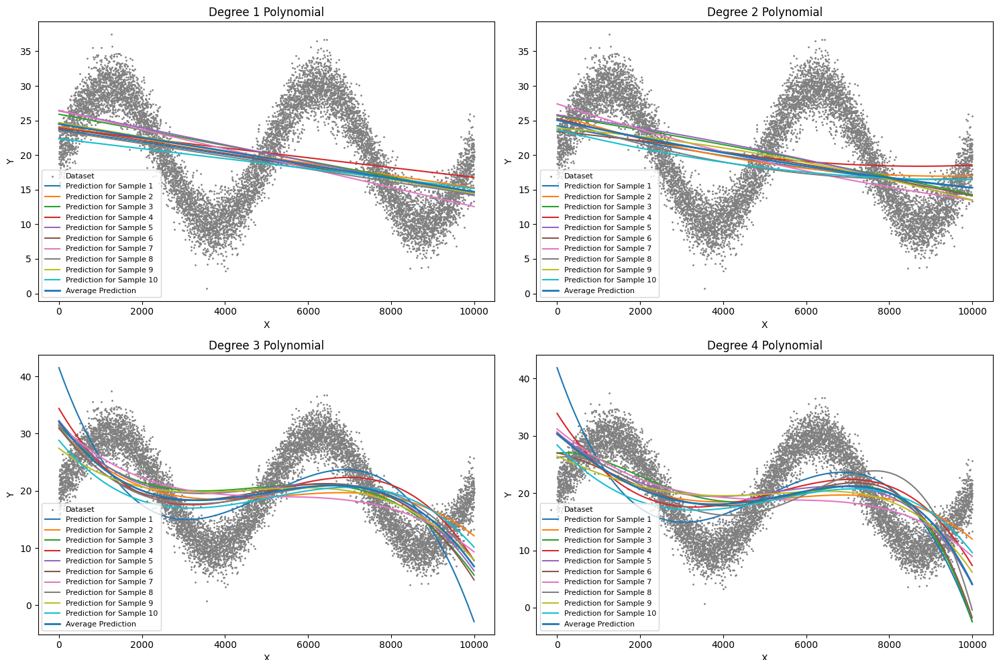

# Bias-Variance Tradeoff: Exploring Model Selection in Machine Learning  

This project demonstrates the **Bias-Variance Tradeoff**, a fundamental concept in machine learning that helps balance model complexity and performance. By simulating a regression task with synthetic data, the project evaluates the relationship between bias, variance, and total error to determine the optimal model. Also, it showcases why validation error is used in ML for model selection.

---

## Overview  

In machine learning, choosing the right model for a given dataset often involves a tradeoff:  
- **Simpler models** may underfit the data, resulting in high bias and lower accuracy.  
- **Complex models** can overfit the data, leading to high variance and poor generalization on unseen data.  

The **Bias-Variance Tradeoff** provides insights into this dilemma, guiding the selection of a model that minimizes the total error.

---

## Key Concepts  

### Bias  
The difference between the expected prediction of the model and the true underlying function. High bias indicates underfitting.  

### Variance  
The variability of model predictions for different training datasets. High variance indicates overfitting.  

### Total Error  
The sum of bias squared and variance:  

$$ 
\text{Total Error} = \text{Bias}^2 + \text{Variance} 
$$

---

## Methodology  

### Dataset Creation  
A sine wave function with added Gaussian noise models the target variable:  

$$ 
f(x) = A\sin\left(\frac{2\pi}{T} \cdot x\right) + c \quad \text{and} \quad r(x) = f(x) + \epsilon 
$$  

### Sampling  
Generate $S$ sample datasets of fixed size from the universal dataset.  

### Model Fitting  
Fit polynomial estimators $g_{is}(x)$ of varying degrees $i$ on each sample dataset $s$.  

### Bias and Variance Calculation  
Compute bias and variance for each polynomial degree:  

$$ 
bias_i^2 = \frac{1}{\text{N}}\cdot \sum_{t} (f(x^t) - \frac{1}{\text{S}}\cdot \sum_{s}g_{is} )^2
$$  

$$ 
variance_i = \frac{1}{N\cdot S} \sum_{t} \sum_{s}(g_{is}(x^t) - \frac{1}{\text{S}}\cdot \sum_{s}g_{is}(x^t) )^2 
$$  

### Model Selection  
Find the degree with the minimum total error:  

$$ 
\text{Total Error} = \text{Bias}^2 + \text{Variance} 
$$  

### Validation  
Use cross-validation to identify the best model degree.  

---

## Results  

- The best model (polynomial degree) was determined using both the **total error** and **cross-validation error**.  
- Validation error serves as a good proxy for total error when the latter is not directly computable.

## Contribution
Any improvements/corrections/feedback are always welcome. Please feel free to send a PR. Star :star the repo if you learned something new. Thanks.
